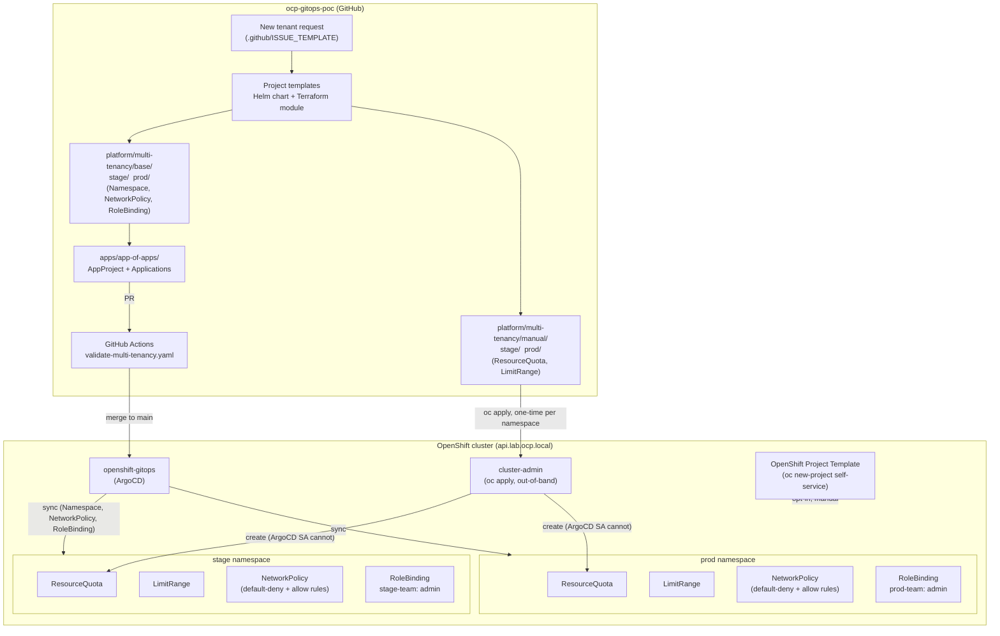

# Multi-Tenancy & Namespace Isolation — High-Level Design

## Objective

Add `stage` and `prod` as governed, self-service tenant namespaces on the
existing `lab.ocp.local` OpenShift cluster, on top of the GitOps platform
already established in this repo (`openshift-gitops` / ArgoCD, App-of-Apps).

## Architecture

## Isolation model

| Layer | Mechanism | Effect |
|---|---|---|
| Network | `NetworkPolicy`: default-deny-all, then allow same-namespace, OpenShift router, monitoring, DNS | `stage` and `prod` cannot reach each other or any other tenant by default |
| Compute | `ResourceQuota` per namespace (applied manually, not via ArgoCD — see below) | Caps aggregate CPU/memory/pods/PVCs/services per tenant — a runaway workload in one namespace can't starve the cluster or another tenant |
| Container defaults | `LimitRange` (also applied manually) | Every container gets sane CPU/memory defaults even if the pod spec omits them, and is capped at a per-container max |
| Identity/RBAC | Namespace-scoped `admin` `RoleBinding` to a tenant group | Tenants self-manage within their namespace without cluster-admin, and without visibility into other tenants |
| Pod security | `pod-security.kubernetes.io/enforce: restricted` label | Blocks privileged/host-access pod specs at admission |
| GitOps | ArgoCD `AppProject` scoped to `stage`/`prod` destinations only, whitelisted resource kinds only | Even a compromised Git commit can't push cluster-admin-level objects through this pipeline |

This mirrors the pattern already in production for `redis-platform`
(`redis-gitops/apps/redis-platform/`) — deny-all + explicit allow, project
AppProject boundaries, in-repo manual quota/limitrange — extended here into a
reusable, self-service template rather than a one-off namespace.

**`ResourceQuota`/`LimitRange` are applied manually, not through ArgoCD.**
Confirmed live on this cluster: OpenShift GitOps auto-grants the ArgoCD
controller an `admin`-equivalent Role per managed namespace, and the
Kubernetes built-in `admin` ClusterRole deliberately excludes write access
to those two kinds (a namespace admin — human or automated — must not be
able to raise its own quota). `stage`/`prod` failed to sync until they were
split into `platform/multi-tenancy/manual/` and applied directly by
cluster-admin. See `platform/multi-tenancy/manual/README.md`.

## Self-service onboarding — three paths

1. **GitOps PR** (used for `stage`/`prod` themselves): render the Helm
   template, commit under `platform/multi-tenancy/base/<name>/`, wire an
   ArgoCD `Application`, open a PR, CI validates, merge triggers auto-sync.
2. **Terraform**: same governed shape via `terraform apply`, for teams that
   prefer Terraform over GitOps manifests, applied outside ArgoCD.
3. **`oc new-project` (OpenShift-native)**: a cluster-wide
   `projectRequestTemplate` so any `self-provisioner` user's `oc new-project`
   comes out pre-governed. Opt-in, manual, cluster-admin gated — see
   `platform/multi-tenancy/openshift/README.md`.

All three converge on the same guardrails (quota, limits, network policy,
scoped RBAC, restricted pod security) — see
`platform/multi-tenancy/onboarding/ONBOARDING.md` for the full procedure.

## CI/CD integration

`.github/workflows/validate-multi-tenancy.yaml` runs on every PR/push
touching `platform/multi-tenancy/**` or `apps/app-of-apps/**`:
yamllint → `kustomize build` + `kubectl apply --dry-run=client` +
kubeconform (schema-strict) → `helm lint`/`helm template` → `terraform fmt
-check`/`validate`. Nothing in CI touches the live cluster — GitHub-hosted
runners can't reach `api.lab.ocp.local` (private lab network); actual
deployment is ArgoCD sync after merge (GitOps path) or a locally-run
`terraform apply`/`oc apply` (Terraform / native paths).
